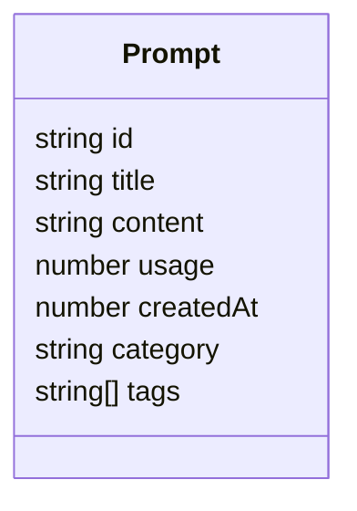
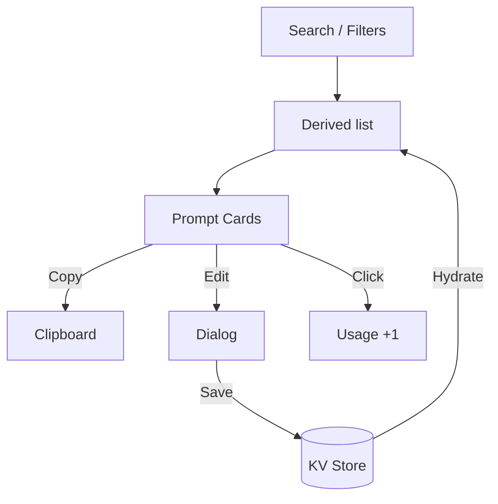

<div align="center">

  

  <h1>Prompt Nest</h1>
  <p><strong>Your beautifully organized home for AI prompts.</strong></p>

  <p>
    <a href="https://img.shields.io/badge/Node-%3E%3D%2018-339933?logo=nodedotjs&logoColor=white"></a>
    <a href="https://img.shields.io/badge/React-19-61DAFB?logo=react&logoColor=white"></a>
    <a href="https://img.shields.io/badge/Vite-6-646CFF?logo=vite&logoColor=white"></a>
    <a href="https://img.shields.io/badge/TypeScript-5-3178C6?logo=typescript&logoColor=white"></a>
    <a href="https://img.shields.io/badge/Tailwind-4-06B6D4?logo=tailwindcss&logoColor=white"></a>
    <a href="LICENSE"></a>
    <a href="#-contributing"></a>
  </p>

  <p>
    Curate, tag, search, and copy your favorite prompts with elegance. Designed with an ocean-inspired aesthetic, built for speed, and crafted for flow.
  </p>

</div>

---

## ✨ Highlights

- Lightning-fast search with category and tag filters
- Add, edit, delete prompts with a delightful modal experience
- Copy-to-clipboard with one click and usage stats tracking
- Ocean-inspired, responsive UI with subtle motion and polish
- Local-first storage via `useKV` — your data, instantly available
- Built on React 19, Vite 6, TypeScript, Tailwind v4, Radix UI patterns

---

## 🚀 Quickstart

Prerequisites: Node.js 18+ (or Bun 1.1+ / pnpm 9+)

1) Install dependencies

```bash
npm install
# or
pnpm install
# or
bun install
```

2) Start the dev server

```bash
npm run dev
# Vite defaults to http://localhost:5173
```

3) Build for production

```bash
npm run build && npm run preview
```

---

## 🧭 Why Prompt Nest?

- Curate once, reuse forever: your best prompts at your fingertips.
- Structure that scales: categories plus multi-tag filters keep chaos out.
- Flow-first UX: minimal friction, maximum focus and delight.
- Local-first by default: instant, private, no setup required.

---

## 🧩 Features, In Detail

- Smart filtering: full-text search + category + tag intersection
- Elegant cards: glanceable titles, usage droplets, and compact tags
- One-click copy: tap any card to copy instantly (with toast feedback)
- Usage heat: popular prompts shimmer to surface your frequent go-tos
- Guided creation: accessible dialogs, keyboard-friendly inputs, tag command menu
- Thoughtful theming: ocean palette, smooth hover, gentle motion, readable typography

---

## 🧠 Data Model

Prompts are stored locally via `@github/spark` KV using a typed shape:

```ts
interface Prompt {
  id: string
  title: string
  content: string
  usage: number
  createdAt: number
  category: string
  tags: string[]
}
```

Example entry:

```json
{
  "id": "1725678901234",
  "title": "Bug triage assistant",
  "content": "You are a meticulous triager...",
  "usage": 12,
  "createdAt": 1725678901234,
  "category": "Code & Development",
  "tags": ["debugging", "analysis", "planning"]
}
```

Mermaid quick glance:



---

## 🏗️ Architecture

- React 19 + Vite 6 (ESM, lightning-fast HMR)
- TypeScript throughout
- Tailwind v4 for design system tokens and utilities
- Radix UI + headless patterns for accessible primitives
- `@github/spark` hooks for local KV storage (`useKV`)
- Sonner for tasteful toasts

Component flow:



---

## 📁 Project Structure

```
src/
  App.tsx                 # Main UI: search, filters, grid, dialogs
  styles/theme.css        # Tokens, theming, global scales
  index.css               # Ocean palette, motion, utilities
  components/ui/*         # Headless + styled UI primitives
  hooks/use-mobile.ts     # Small responsive helper
  assets/images/nest-logo.svg
```

---

## 🎨 Theming & Aesthetics

- Ocean palette with deep-sea blues, seafoam accents, and pearl whites
- Shimmer header, wave icon motion, ripple FAB, and subtle card lift
- Responsive from mobile to desktop with careful density and spacing

Tweak colors in `src/index.css` and tokens in `src/styles/theme.css`.

---

## ⌨️ Commands

- `npm run dev`: start development server
- `npm run build`: type-check and build for production
- `npm run preview`: preview the production build locally
- `npm run lint`: lint the project

---

## 🔒 Security

Please see `SECURITY.md` for responsible disclosure guidelines.

---

## 🤝 Contributing

Contributions are warmly welcomed!

1) Fork and create a feature branch
2) Keep changes focused and clearly scoped
3) Add context in PR description with before/after rationale
4) Be kind, constructive, and detail-oriented

Ideas that would be amazing to add:

- Import/export (JSON, CSV), cloud sync
- Prompt sharing, templates, pinned favorites
- AI-powered “Enhance Prompts” workflow
- Keyboard shortcuts and power actions

---

## 📜 License

MIT — see `LICENSE` for details.

---

<div align="center">
  <sub>
    Crafted with care — may your best ideas always find a home. 🌊
  </sub>
</div>
